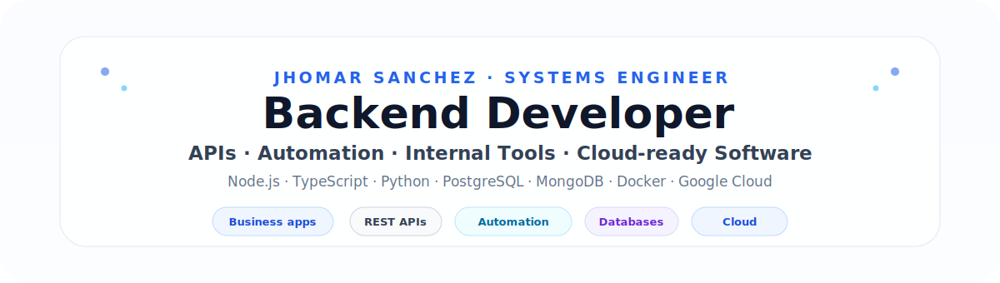
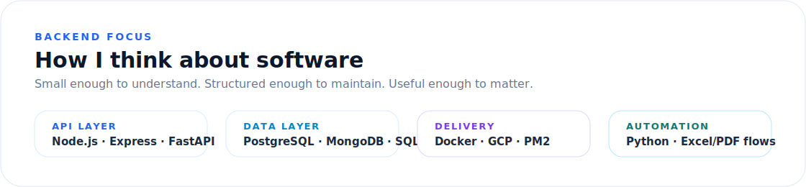
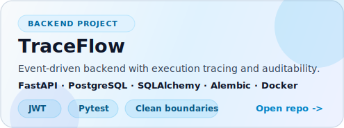
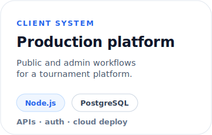
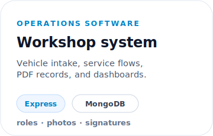
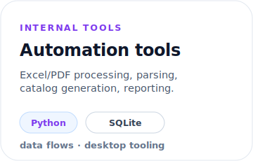
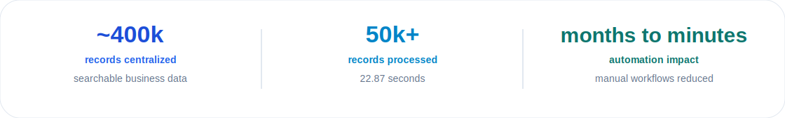
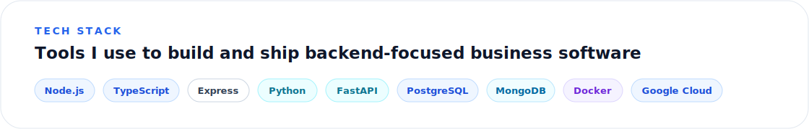
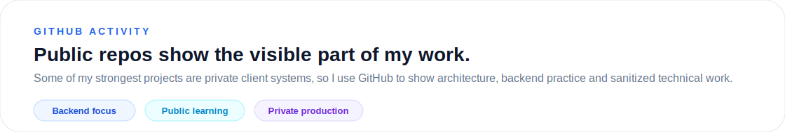

  

  <a href="mailto:jhomarsanchez@outlook.es">Email</a> ·
  <a href="https://www.linkedin.com/in/jhomar-sanchez-a68223283">LinkedIn</a> ·
  <a href="https://github.com/JhomarSanchez">GitHub</a>

## Hi, I'm Jhomar

I'm a **Systems and Informatics Engineer** focused on **backend development, automation, internal tools, and cloud-ready business software**.

I like building software that is useful in real contexts: **REST APIs, business workflows, data processing, PDF/Excel automation, image handling, and systems people can actually operate and maintain**.

  

## Backend focus

  

## Featured public project

**TraceFlow** is a backend-oriented project for event-driven workflow execution with persisted traceability.

- Built with **FastAPI, PostgreSQL, SQLAlchemy 2.x, Alembic, JWT, Docker, and pytest**.
- Uses a **modular monolith** structure with API, application, domain, infrastructure, and core layers.
- Demonstrates event ingestion, workflow resolution, ordered step execution, execution history, and step-level traces.

## Selected work

<table>
  <tr>
    <td width="33%"></td>
    <td width="33%"></td>
    <td width="33%"></td>
  </tr>
</table>

### What those systems involved

- **Production platform**: REST API design, authentication, business rules, PostgreSQL, image processing, and deployment on Google Cloud.
- **Workshop system**: operational workflows, multi-role access, photo evidence, PDF service records, and on-premises deployment support.
- **Automation tools**: Excel/PDF processing, data normalization, internal reporting, desktop tooling, and workflow acceleration.

## Impact snapshot

  

- Centralized **~400,000 business records** into searchable internal systems.
- Processed **50,000+ combined records in 22.87 seconds** through indexed reconciliation workflows.
- Reduced manual catalog-related processes from **months to minutes** with Python/PDF automation.

## Tech stack

  

## GitHub activity

  

## Currently focused on

- Backend APIs with **Node.js, TypeScript, Express, Python, and FastAPI**.
- Database-backed systems with **PostgreSQL, MongoDB, SQLite, SQLAlchemy, and Alembic**.
- Automation and internal tools for **business operations, Excel/PDF workflows, and data-heavy processes**.
- Cloud and deployment practices with **Docker, Google Cloud, PM2, and Cloudflare Tunnel**.

## Let's connect

I'm open to **Backend Developer, Software Developer, Automation Developer, Internal Tools Developer, and Cloud-oriented roles**.

- Bucaramanga, Colombia
- jhomarsanchez@outlook.es
- LinkedIn: https://www.linkedin.com/in/jhomar-sanchez-a68223283
- TraceFlow: https://github.com/JhomarSanchez/traceflow
