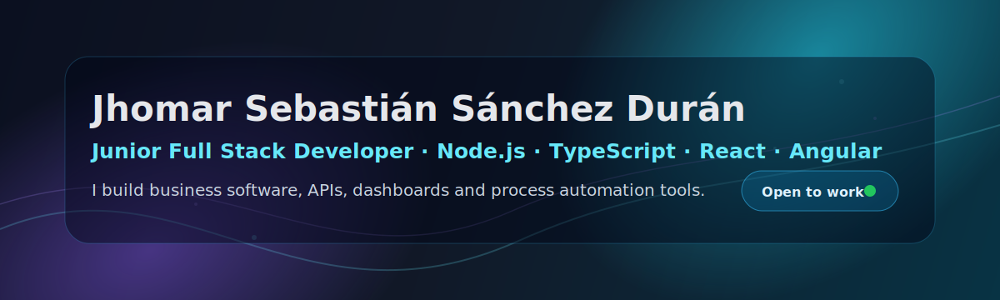

  

  
  
  

## Hi, I'm Jhomar 👋

I'm a **Systems and Informatics Engineer** focused on **full-stack development, backend APIs and process automation**.

I have built real business software as a freelance developer, including a public tournament-management platform, an internal workshop-management system, and automation tools for Excel/PDF-heavy workflows.

Currently looking for opportunities as a **Junior Full Stack Developer**, especially with **Node.js, TypeScript, React, Angular, PostgreSQL and MongoDB**.

## What I build

- **Business web applications** with protected admin panels, roles and dashboards.
- **REST APIs** with authentication, validation, image processing and database integrations.
- **Process automation tools** for Excel, PDF, reports and operational workflows.
- **Internal systems** that replace manual work with maintainable software.

## Tech stack

  
  
  
  
  
  
  
  
  
  
  

## Selected work

### CopaKMX — Tournament Management Platform

**Freelance client project · Private codebase**

Full-stack platform for managing a corporate football tournament with a public website and a protected admin panel.

- Modeled a hierarchical domain with championships, subchampionships, companies, teams, players, matches, standings and statistics.
- Built a REST API with **Node.js, TypeScript, Express and PostgreSQL**.
- Developed admin features for teams, players, matches, results, rankings and promotional images.
- Deployed the solution on **Google Cloud Platform**.

> The production site is public, but the source code is private because it was developed for a third-party company.

### Frenopartes — Workshop Management System

**Freelance client project · Private codebase**

Internal multi-user system for managing vehicle workshop operations.

- Vehicle entries, customers, services, before/after photos, warranties, entry/exit certificates and digital signatures.
- Role-based access control for administrators, mechanics and cashiers.
- Backend with **Node.js, Express and MongoDB/Mongoose**.
- Frontend with **React, Vite and MUI**.
- PDF generation, image processing, metrics dashboard and production deployment.

> The codebase is private because it belongs to a third-party company and handles internal business workflows.

## Personal projects

### TraceFlow

Backend-oriented project focused on traceability, workflow execution and event logging.

**Stack:** FastAPI · PostgreSQL · SQLAlchemy · Alembic · JWT · Docker · Pytest

### ReconGrid

Desktop tool for spreadsheet reconciliation, workbook comparison and auditable Excel exports.

**Stack:** Electron · JavaScript/TypeScript · Excel processing · Layered architecture

## Professional practice

During my professional internship, I developed internal automation tools for data-heavy business processes:

- Excel/PDF processing and catalog normalization.
- Desktop apps with Electron, Angular and TypeScript.
- PDF automation with Python and PyMuPDF.
- Dashboards, reports and workflow improvements.

## GitHub stats

  
  

> Some of my most relevant work is private because it was developed for real clients. Public repositories show personal projects and sanitized technical work.

## Let's connect

I'm open to **junior full-stack, backend and software developer roles**, remote or hybrid.

- Email: **jhomarsanchez@outlook.es**
- LinkedIn: **Jhomar Sebastián Sánchez Durán**
- Location: **Bucaramanga, Colombia**
